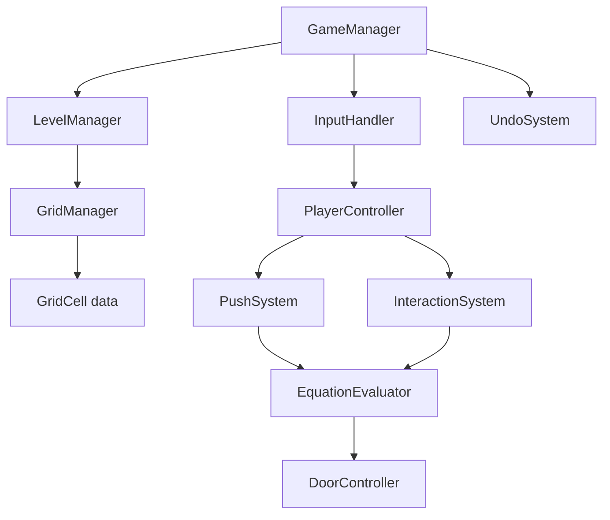

# GDD Implementation Plan — Math Sokoban (KNLVN)

## Architecture Overview



## Folder Structure

```
Assets/_Project/_Scripts/
├── Tech/                          (existing)
│   ├── GridSystem/
│   ├── StateMachine/
│   └── Events/
└── Game/
    ├── Core/
    │   ├── GameManager.cs         ← Singleton<GameManager>
    │   ├── LevelManager.cs        ← Singleton<LevelManager>
    │   ├── EventBusComponent.cs   ← PersistentSingleton<EventBusComponent>
    │   └── UndoSystem.cs
    ├── Grid/
    │   ├── GameGrid.cs            ← inherits from CUHP.Grid<GameGridCell>
    │   ├── CellType.cs            ← enum: Empty, Wall, Blue, Yellow, Red, Star
    │   └── CellContent.cs         ← value object: number / operator / null
    ├── Entities/
    │   ├── PlayerController.cs    ← WASD input + facing direction
    │   ├── PushSystem.cs          ← block-pushing logic
    │   └── InteractionSystem.cs   ← F key pickup/place/swap
    ├── Logic/
    │   ├── EquationEvaluator.cs   ← equation chain scanning + validation
    │   ├── NumberMerger.cs        ← adjacent digit merging (Left>Right>Top>Down)
    │   └── DoorController.cs      ← open/lock red cell
    ├── Data/
    │   ├── LevelData.cs           ← ScriptableObject: grid layout
    │   └── GameEvents.cs          ← new events (LevelLoaded, EquationSolved…)
    └── View/
        ├── GameVisualConfig.cs    ← ScriptableObject: all visual constants
        ├── GridView.cs            ← spawns/refreshes CellView grid + floor bg
        ├── CellView.cs            ← renders a single cell (sprite + text)
        ├── PlayerView.cs          ← character sprite + carried item bubble
        ├── HintArrowView.cs       ← placement indicator shown beside player
        └── SpriteFactory.cs       ← procedural sprite generation (fallbacks)
```

---

## Phase 1 — Data Layer

### CellType.cs
```csharp
public enum CellType { Empty, Wall, Blue, Yellow, Red, Star }
```

### CellContent.cs
- `string RawValue` — "0"…"9", "+", "-", "*", "/", "="
- `bool IsNumber` / `bool IsOperator` / `bool IsEquals`
- `int NumericValue` — parsed int if digit, else 0
- `CellContent Empty` — static singleton

### GameGridCell.cs  (runtime cell data)
```
CellType  CellType
CellContent  Content   ← null = empty cell (for Yellow / Star)
CellContent  FloorItem ← loose items on the floor
Vector2Int  GridPos
GameObject  View
```

### GameGrid.cs
- Inherits from `CUHP.Grid<GameGridCell>` to reuse the core grid logic, debug rendering, and grid coordinate tracking.
- Provides helper queries like `GetBlueCells()` and handles grid-level undo snapshots.

---

## Phase 2 — Player + Push

### PlayerController
- `Vector2Int GridPos`
- `FacingDirection` (Left/Right/Up/Down)
- `CellContent HeldItem`  (max 1)

### Move(Vector2Int dir)
1. Compute `targetPos = GridPos + dir`
2. If wall → block
3. If Blue → block (cannot walk through)
4. If Red && door locked → block
5. If Yellow/Star at `targetPos`:
   - If next cell (`targetPos + dir`) is free → push cell, player moves
   - Cannot push if next cell is wall/blue/another pushable
   - Cannot push Yellow with content into a floor item (only empty Yellow can absorb items)
6. If floor item at `targetPos` and no pushable → player walks on it (item stays until F pressed)
7. Record undo snapshot

### Push(Yellow/Star, dir)
- Move Yellow/Star to next cell
- If next cell has a floor item AND Yellow/Star is empty → absorb item into cell
- After push: trigger EquationEvaluator

---

## Phase 3 — Interaction (F key)

```
FacingCell = GridPos + FacingDir

If player stands on floor item → pickup item (remove from floor, set HeldItem)
Else if FacingCell is Yellow/Star:
    If HeldItem != null:
        If cell empty   → place HeldItem there, clear HeldItem
        If cell has val → swap HeldItem ↔ cell.Content
    // (no HeldItem: just show hint arrow)
Else if FacingCell has floor item AND player on same cell:
    pickup
```

---

## Phase 4 — Equation Evaluator

### Number Merging (runs first, before eval)
Scan all cells left→right, top→down.  
Two adjacent number cells in same row OR column → merge into multi-digit:
- Horizontal: left digit × 10^n + right digits (e.g. `1` `2` → `12`)
- Vertical:   top digit × 10^n + bottom digits
- Only merge if no non-digit gap in between

### Chain Detection
1. Collect all Blue cells → must all appear in same row OR column
2. BFS/walk from any Blue cell along the axis, gathering adjacent cells (Blue, Yellow, Star) that are contiguous
3. Chain must include ALL Blue cells
4. Chain must contain exactly one `=` token

### Evaluation
```
left_tokens  = tokens before "="
right_tokens = tokens after "="
left_val  = evaluate(left_tokens)   // respects *, / before +, -
right_val = evaluate(right_tokens)
valid = (left_val == right_val)
```

Star cell: its numeric contribution is × 2

### Result → DoorController
- valid → DoorController.Open()
- invalid → DoorController.Close()

---

## Phase 5 — Undo System

Stack of `GameSnapshot`:
```csharp
struct GameSnapshot {
    Vector2Int PlayerPos;
    FacingDirection PlayerFacing;
    CellContent PlayerHeld;
    List<GameGridCellSnapshot> GridSnap;
}
```
- Push snapshot **before** every player action (move / push / interact)
- `Undo()`: pop last snapshot, restore state
- Reset: reload LevelData fresh

---

## Phase 6 — Level Data (ScriptableObject)

```csharp
[Serializable]
public class CellDefinition {
    public Vector2Int pos;
    public CellType type;
    public string content; // "5", "+", "=", "" 
}

[CreateAssetMenu]
public class LevelData : ScriptableObject {
    public int width, height;
    public Vector2Int playerStartPos;
    public List<CellDefinition> cells;
}
```

---

## Phase 7 — View Layer

### GameVisualConfig  *(ScriptableObject — single source of truth for all visual constants)*

Create via: **Assets → right-click → Create → KNLVN → Visual Config**  
Assign the asset in **GridView**, **PlayerView**, and **HintArrowView** Inspector fields.

#### Sprite fields (leave null → procedural fallback)
| Field | Fallback | Used by |
|---|---|---|
| `WallSprite` | `CreateWallBrick()` | CellView bg |
| `EmptySprite` | `CreateSquare()` | CellView bg |
| `BlueSprite` | `CreateSquare()` | CellView bg |
| `YellowSprite` | `CreateRoundedRect()` | CellView bg |
| `StarSprite` | `CreateStar()` | CellView bg |
| `RedLockedSprite` / `RedOpenSprite` | `CreateDoor()` | CellView bg |
| `ContentPanelSprite` | `CreateRoundedRect(32, 0.28)` | CellView panel |
| `FloorTokenSprite` | `CreateCircle(32)` | CellView floor token |
| `FloorTileSprite` | `CreateFloorTile()` | GridView floor bg |
| `PlayerBodySprite` | `CreateCircle(64)` | PlayerView body |
| `HeldBubbleSprite` | `CreateCircle(64)` | PlayerView bubble |
| `FacingMarkerSprite` | `CreateTargetMarker()` | PlayerView marker |

> **Unity fake-null gotcha**: All sprite getters use `== null` (not `??`) to correctly detect unassigned SO fields.

#### Color fields
`WallColor`, `EmptyColor`, `BlueColor`, `YellowColor`, `StarColor`, `RedLockColor`, `RedOpenColor`, `PlayerColor`, `HeldBubbleColor`, `ContentPanelColor`, `FloorTokenColor`, `FacingMarkerColor`, `HintArrowColor`

#### Layout fields (Player)
| Field | Default | Effect |
|---|---|---|
| `PlayerBodyScale` | `0.8` | Uniform scale of player sprite |
| `BubbleOffsetY` | `0.75` | Y offset of held-item bubble above player |
| `BubbleScale` | `0.45` | Uniform scale of bubble |
| `HeldLabelCharSize` | `0.216` | TextMesh characterSize inside bubble |

#### Layout fields (Cell)
| Field | Default | Effect |
|---|---|---|
| `ContentPanelScale` | `0.62` | Scale of number/operator badge inside cell |
| `ContentLabelCharSize` | `0.154` | TextMesh characterSize for content label |
| `FloorTokenScale` | `0.32` | Scale of floor-item token badge |
| `FloorLabelCharSize` | `0.168` | TextMesh characterSize for floor label |
| `LabelFontSize` | `100` | Shared fontSize (high = sharper, no blur) |

#### Animation fields (shared)
| Field | Default | Effect |
|---|---|---|
| `MoveDuration` | `0.12s` | Duration of player move and box push |
| `MoveCurve` | EaseInOut | Easing applied to both animations |

### CellView — rendering rules
- **Layer 0** (`sortingOrder 0`): background sprite + bg color, covers full cell
- **Layer 1+2** (`sortingOrder 1/2`): content panel badge (hidden when cell is empty)
  - Star cells: label text = `"{value}×2"`, characterSize × 0.7 (30% smaller)
- **Layer 3+4** (`sortingOrder 3/4`): floor token badge (hidden when no floor item)
- All child GOs built inside `Init()` (after `_cfg` is set), **not** in `Awake()`
- Sprite pivot fix: `CreateSquare`, `CreateWallBrick`, `CreateDoor` use **center pivot** `(0.5, 0.5)` to align with `GetCenterWorldPosition`

### PlayerView — notes
- Player body, held-item bubble, and facing marker built procedurally in `Awake() → BuildVisuals()`
- Facing marker is a **sibling** of the player GO (doesn't move with player)
- Marker is **hidden** when facing `Wall` or `Empty` — only shows on Blue, Yellow, Star, Red cells
- Move animation reads `MoveDuration`/`MoveCurve` from `GameVisualConfig`

### HintArrowView — notes
- Shows arrow between player and target when: player **holds an item** AND faces a **Yellow or Star** cell
- Arrow color configurable via `HintArrowColor` in `GameVisualConfig`

---

## Key Edge Cases & Rules

| Situation | Behavior |
|---|---|
| Push empty Yellow into floor item | Yellow absorbs item |
| Push Yellow-with-value into floor item | Blocked (cannot push valued cell) |
| Hold item + face Blue | Show hint arrow, but cannot place on Blue |
| Hold item + face Red | No hint arrow shown |
| Star cell numeric | Value × 2 in equation; display as `{n}×2` at 70% font size |
| Multi-digit spanning Blue+Yellow | Treated as single number in equation |
| Undo after undo | Not allowed (only 1 consecutive undo) |
| Equation chain branches | Invalid — must be strictly linear |
| Facing marker on Wall/Empty | Marker hidden |
| SO sprite field left unassigned | Procedural fallback used (fake-null safe) |

---

## Implementation Order (task sequence)

1. `CellType` / `CellContent` / `GameGridCell` data classes
2. `LevelData` ScriptableObject + one test level
3. `LevelManager` — parse LevelData, instantiate grid
4. `PlayerController` — WASD + facing
5. `PushSystem` — push rules
6. `InteractionSystem` — F key logic
7. `NumberMerger` — digit adjacency merge
8. `EquationEvaluator` — chain detection + math eval
9. `DoorController` — open/close
10. `UndoSystem` — snapshot stack
11. `GameVisualConfig` SO — create asset, assign all sprites/colors/sizes
12. `GridView` / `CellView` / `PlayerView` / `HintArrowView` — visuals
